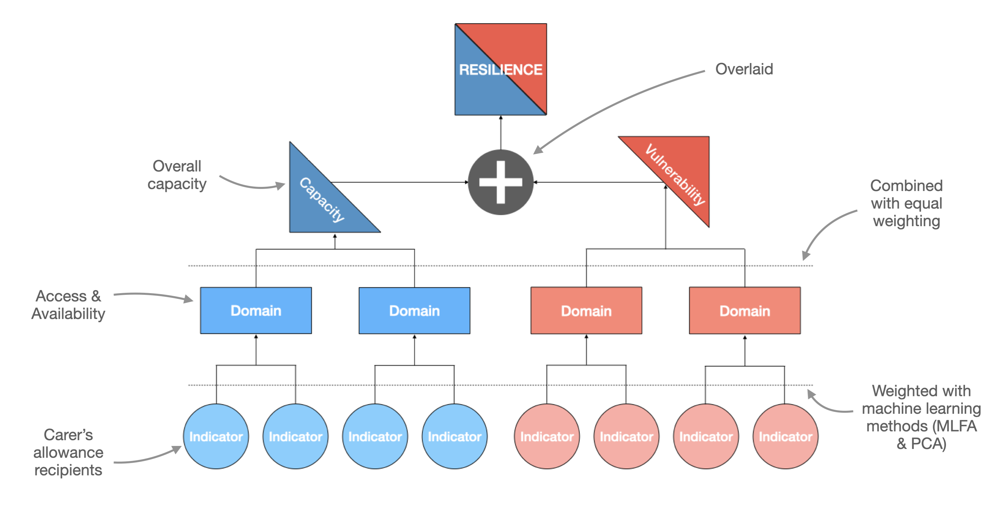

# Overview {#overview}

## Introduction

### What does it do?
The Resilience Index **maps** Local Authorities based on potential **need for support** (vulnerability) and **capacity** to meet that need.

### What is covered
There are **two** indices, based on the British Red Cross's **strategic causes**:

- Disasters & Emergencies
- Health Inequalities

We are not developing a Resilience Index for Displacement & Migration, due to the sensitive nature of asylum and resettlement data. Instead, we are producing bespoke analyses to inform this strategic cause.

### Where is covered?
The Resilience Index maps **Local Authorities** in each of the four devolved nations across the **UK**.

## Output (Maps)

- **Eight** maps in total, comprised of **two** indices, across **four** nations.
- Each map is specific to a single strategic cause and nation and presents a resilience score:

{width=100%}

## Output (Data tables)

- Data tables will also be available with indicator scores, domain scores, vulnerability & capacity scores, and overall resilience scores:

{width=100%}

## Calculating Resilience

- **Indicators** are combined to **form domain**s, which are **then combined to** form capacity & vulnerability **scores**, which are then compared side-by-side to form a resilience score.

{width=100%}

## FAQ

### Does the Resilience Index replace the COVID-19 Vulnerability Index?
No. The indices cover different needs. The COVID-19 VI is specific to
COVID-19 only.

### Can the indices of each nation be compared side by side?
No. They are designed to be viewed independently.

## Status

- The Resilience Index is currently under active development, and only exists in a limited capacity at this time. Check the metadata files in `/R` to see the progress of each cause in each nation.

- Last update: 07.02.2022
- Notes: complete segments are only provisional and are subject to change (e.g., indicator amendments and weighting)

| Nation | Strategic Cause | Vulnerability | Capacity | Shocks |
| --- | --- | --- | --- | --- |
| England | Health Inequalities | `r "\U00002705"` | `r "\U00002705"` | `r "\U0001F6AB"` |
| England | Disasters & Emergencies | `r "\U0001F6A7"` - Under development | `r "\U0001F6A7"` - Under development | `r "\U00002705"` - Heat Hazards |
| Scotland | Health Inequalities | `r "\U00002705"` | `r "\U0000274C"` | `r "\U0001F6AB"` |
| Scotland | Disasters & Emergencies | `r "\U00002705"`: | `r "\U0000274C"` | `r "\U00002705"` - Heat Hazards |
| Wales | Health Inequalities | `r "\U0001F6A7"` - Under development | `r "\U0000274C"` | `r "\U0001F6AB"` |
| Wales | Disasters & Emergencies | `r "\U00002705"` | `r "\U0000274C"` | `r "\U0000274C"` |
| Northern Ireland | Health Inequalities | `r "\U00002705"` | `r "\U00002705"` | `r "\U0001F6AB"` |
| Northern Ireland | Disasters & Emergencies | `r "\U00002705"` | `r "\U0001F6A7"` - Under development | `r "\U00002705"` - Fires & Floods |

To add:

- How to find metadata
- Development Status
- Interpreting the results and tables
- Embed HTML Widget app
