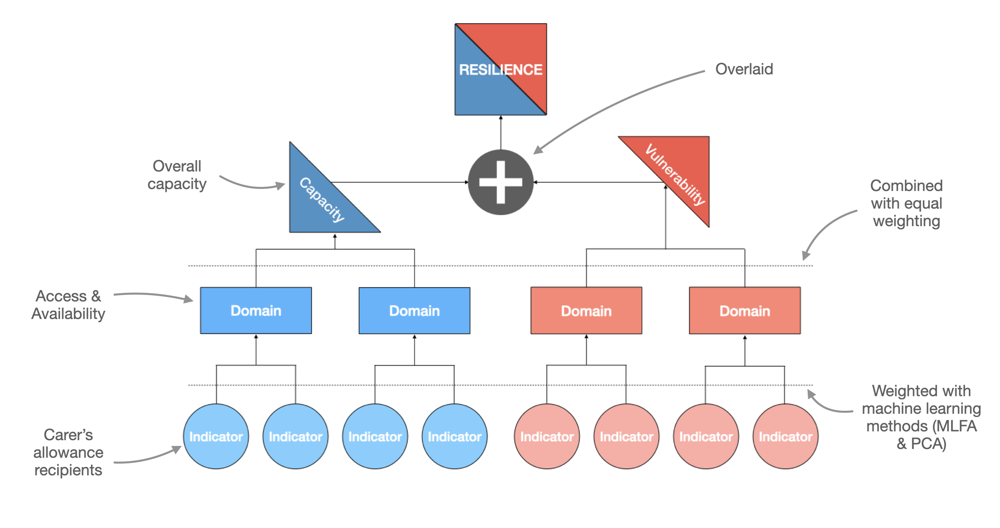
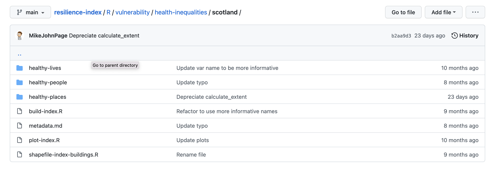
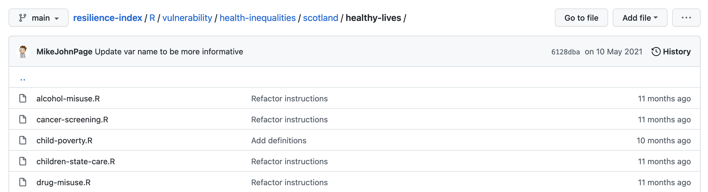
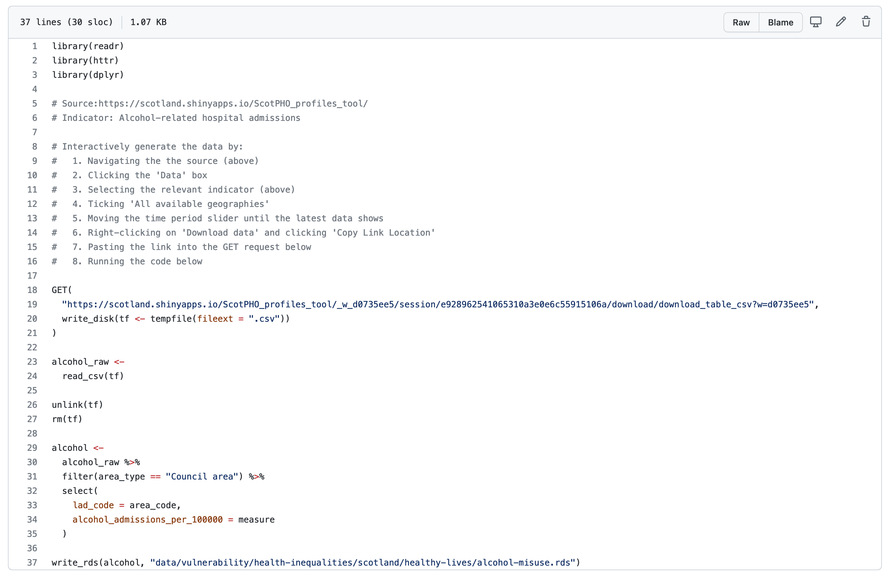
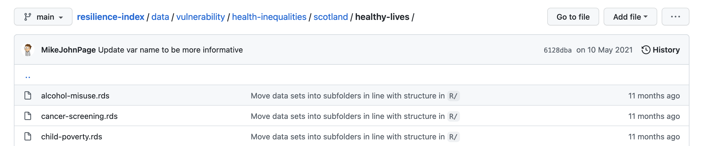
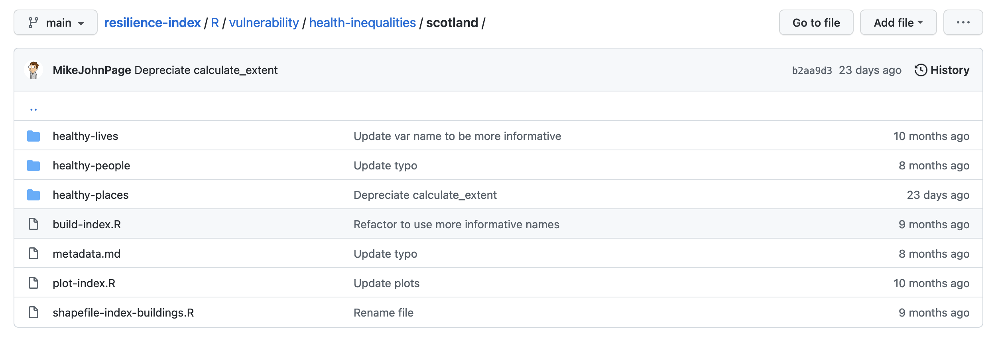

# Developing an Index

This chapter runs through the process of developing a whole index for a single
nation. Its purpose is to demonstrate the top-level workflow and ideas, before
later chapters dive into the technical, nitty-girtty details of the build
process.

For demonstration purposes, let's run through the workflow to build a Health
Inequalities Index for Scotland.

## End goal

The end goal is to compute a resilience score, which is a combination of
vulnerability and capacity:

{width=100%}

The process to achieve the end goal is as follows:

1. Add indicators
2. Combine indicators to form domains
3. Combine domains and compute vulnerability and capacity scores
4. Combine vulnerability and capacity scores to make an overall resilience score

## Add indicators

In the Resilience Index [GitHub](https://github.com/britishredcrosssociety/resilience-index)
repo, navigate to the correct `domain/strategic-cause/nation` subfolder.
To add vulnerability indicators to the Scottish Heath Inequalities index,
navigate to `R/vulnerability/health-inequalities/scotland`:

{width=100%}

If the model has subdomains, like in the case above, navigate into the
subsequent folder:

{width=100%}

To add an indicator, add a new `.R` file. Each file should contain a stand-alone
modular script, that should compute the statistic for a single indicator:

{width=100%}

The output of this script is then saved in a `.rds` format in the `data/` folder
in the root of the repo, in a structure which mirrors that of the file path in
the `R/` folder:

{width=100%}

## Combine indicators

Once indicators have been added, they are joined in a `build-index.R` script,
located in the root of the `domain/strategic-cause/nation` subfolder:

{width=100%}

The process to combine domains varies by the strategic-cause and model of
interest. The [OECD handbook](https://www.oecd.org/sdd/42495745.pdf) on
constructing composite indicators should be used as a reference text throughout.
To combine vulnerability indicators for Scottish Health Inequalities, the
following steps needs to be taken:

1. Load indicators into the R session: 
```{r, eval=FALSE}
# Load indicators
healthy_lives_indicators <-
  load_indicators(
    path = "data/vulnerability/health-inequalities/scotland/healthy-lives",
    key = "lad_code"
  )
```

2. Scale and align the indicators so that higher values equate to higher
vulnerability scores: multiply misaligned indicators by -1:

```{r, eval = FALSE}
healthy_lives_scaled <-
  healthy_lives_indicators %>%
  mutate(
    gcse_qualifications_percent = gcse_qualifications_percent * -1,
    healthy_eating_percent = healthy_eating_percent * -1,
    job_related_training_percent = job_related_training_percent * -1,
    activity_levels_met_percent = activity_levels_met_percent * -1,
    vaccine_rate_mean = vaccine_rate_mean * -1,
    young_people_training_percent = young_people_training_percent * -1,
    cancer_screening_percent = cancer_screening_percent * -1
  )
```

2. Apply functional transformations (e.g., log) to address non-normal
distributions if necessary

3. Normalise indicators to a mean of 0 and SD +-1:
```{r, eval = FALSE}
healthy_lives_weighted <-
  healthy_lives_scaled %>%
  normalise_indicators()
```

4. Weight indicators using PCA or MLFA if appropriate

5. Calculate domain scores by ranking and quantising the (weighted) normalised
scores:

```{r, eval=FALSE}
  healthy_lives_weighted %>%
  calculate_domain_scores(
    domain_name = "healthy_lives",
    num_quantiles = 10
  )
```

## Combine domains

Combine domains with equal weighting and rank and quantise the output to produce
a composite score:

```{r, eval = FALSE}
health_inequalities_scores <-
  healthy_lives_scores %>%
  left_join(
    healthy_people_scores,
    by = "lad_code"
  ) %>%
  left_join(
    healthy_places_scores,
    by = "lad_code"
  ) %>%
  select(
    lad_code,
    ends_with("domain_score")
  ) %>%
  calculate_composite_score(
    index_name = "health_inequalities",
    num_quantiles = 10
  )
```

## Combine vulnerability and capacity

Currently, vulnerability and capacity composite scores are not computed on to
produce a resilience score. Rather, the two scores are plotted using a bivariate
choropleth map, which examines the intersection of the two variables. For an
example of how these plots are run, see [here](https://github.com/britishredcrosssociety/resilience-index/blob/main/R/vulnerability/health-inequalities/scotland/plot-index.R).