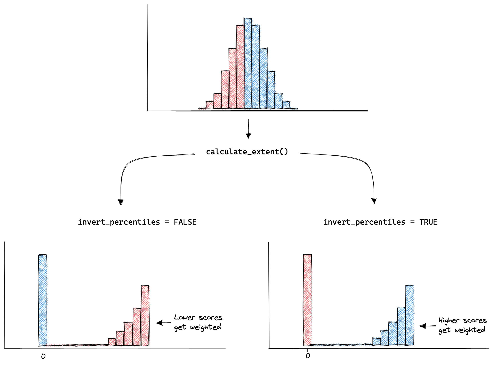
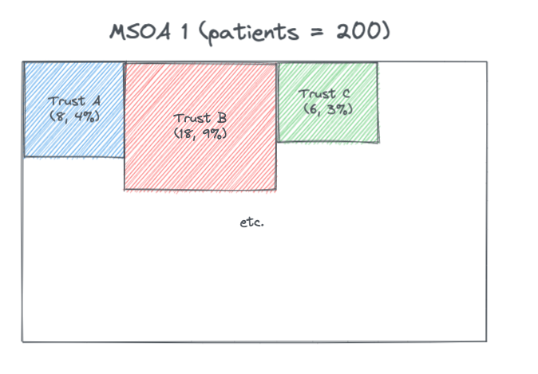
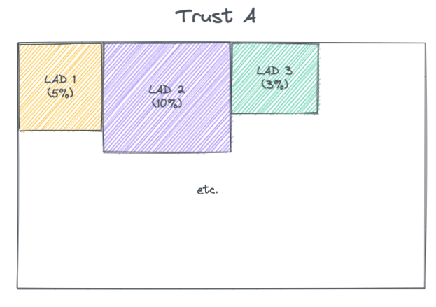

# Technical

## Aligning Indicators

### Final outputs

To match user expectation and to build a simple mental model, higher should mean
higher. This means:  

- **Higher** vulnerability deciles/ranks = **higher** vulnerability  
- **Higher** capacity deciles/ranks = **higher** capacity

Most users, however, will want to know areas with the *highest* vulnerability and
the *lowest* capacity. Well designed plots and maps should guide to user to these
areas without challenging the mental model of higher is higher. For example, a
bivariate choropleth map might highlight areas of high vulnerability and low
capacity in a dark colour, with the inverse of these areas in a light colour. The
colour gradient should direct the users attention and keep the mental model intact.

### Misalignment

Despite the end goal for the final outputs, indicators do not always align in the
direction of their scales for the domain they underpin. For example, in the model
of England Health Capacity, *higher* bed availability represents *higher* capacity,
yet *higher* ambulance response waiting times represent *lower* capacity. To
control for this, indicators need inverting at several stages during the computation
of the indices to ensure concistency in development methods, and alignment of the
final outputs.

### Stage 1: indicator files

Each indicator of each domain for both resilience and capacity resides in its
own unique file. To make these modular files usable across projects and to ease
in updating and understanding them, the output of each file should be aligned to
the *expected* direction given by the indicator name. Using the same example from
above for capacity, higher scores in the output of the file `bed-availability.R` should indicate
higher availability, and higher scores in the output of the file `ambulance-waiting-times.R`
should indicate higher waiting times. Note, that these two indicators do not yet
align to the goal that a **higher** score equals **higher** capacity. This should
be tackled in the later `build-index.R` file where indicators are combined.

For any indicators that have been aggregated from a lower level geography to a 
higher level geography using the `calculate_extent()` function, it is important
that the argument `invert_percentiles` is set correctly. `calculate_extent()` works
by weighting one end of the distribution of the input indicator:

{width=100%}

To ensure areas of highest vulnerability and lowest capacity are correctly weighted,
the following heuristics should be followed for the input indicator:  

- If a higher score equates to higher vulnerability, set `invert_percentiles` to `TRUE`
- If a higher score equares to lower vulnerability, set `invert_percentiles` to `FALSE`
- If a higher score equates to higher capacity, set `invert_percentiles` to `FALSE`
- If a higher score eqates to lower capacity, set `invert_percentiles` to `TRUE`

Note, that the setting of `invert_percentiles` is *indicator* specific, and not
*vulnerability/capacity* specific. This means a general rule for vulnerability or
capacity (e.g., always set `invert_percentiles` to `TRUE`) can not be set.

### Stage 2: join indicators

Each index contains a `build-index.R` file in the root of the specific index folder.
The first step of these build scripts is to align indicators. This achieved by
mutiplying misaligned indicators by -1.

For any vulnerability build script, the indicators should be aligned so that a
**higher** score equals to **higher** vulnerability. For example the indicator
`mean_vaccine_rate` should be multiplied by -1.

For any capacity build script, the indicators should be aligned so that a **higher**
score equals a **lower** capacity. Note, this does not align the capacity indicators
to the format desired for the output. This gets taken care of in stage 3, detailed
below. The reason the indicators needs to be aligned like this is to keep consistency
in methods across the vulnerability and capacity models. For example, later in the
`build-index.R` scripts, data is log-transformed to highlight areas of most need.
In the case of capacity, this is areas of *lowest* capacity, and in the case of
vulnerability, this is the areas of the *highest* vulnerability.

### Stage 3: realign files ranks & deciles

Capacity models require a final step of inverting ranks and deciles so that
**higher scores** equal **higher capacity**. This can be achieved using the series
of `inver*` functions in `R/utils.R`

## Models
Sendai & Transactional model of stress. Indicator selection.

## Geography

## Contributing

## Repo navigation

## Journal paper

## Aggregration techniques

### Health capacity - England

There are additional complexities for the indicator data used within the capacity section of the health index for England. This is due to the fact that most of the data available was at NHS Trust level but the desired outcome of the index is at Local Authority Districts (i.e. Local Tier Local Authorities). NHS Trusts are not coterminous to LADs (or UTLAs, MSOA or LSOA etc.) or vice versa. 

##### Public Health England catchment calculations

Public Health England (PHE) have collected data on the number of patients (elective and emergency) who are admitted from a Middle Super Output Area (MSOA) to a given NHS Trust, and also the number of people from a MSOA to any provider. This gives the proportion of the MSOA patients at each Trust.[1](https://app.box.com/s/qh8gzpzeo1firv1ezfxx2e6c4tgtrudl) 

{width=90%}

These proportions were multiplied by the MSOA population (from ONS population numbers) to give the MSOA catchment population for a provider, and then these MSOA catchments were summed across each Trust to give a Trust catchment population.[1](https://app.box.com/s/qh8gzpzeo1firv1ezfxx2e6c4tgtrudl) In the above example if the MSOA population is 1,000 then the estimated catchment for Trust A for MSOA 1 is 400 people. 

Note that in the data the proportions don't always sum to 100% when summed across each MSOA. Contacting PHE to find out more about this. 

Since have both the Trust catchment population and the MSOA catchments for a Trust can estimate the split of Trust population by MSOAs. 

This data can be used to **estimate**: 

* MSOA population proportioned to Trusts
* Trust population proportioned to MSOAs

MSOAs are coterminous to LADs and so can be aggregated and so the above can also be **estimated** for LADs. This estimation method leads to the proportions summing to 100% for a given LAD. 

It is important to note this method is an estimate and is based on a sample of data. 

Also important to note that the data only includes acute Trusts and so does not have information on non-acute trusts such as community and mental health providers. Some of the indicators had data from these kind of Trusts and it was not possible at this time to attribute this information across LADs and therefore was not possible to add this to the index with this current method.    

#### Dealing with changes in Trust codes 
Trust codes can change because Trusts can combine and disaggregate over time. 

The geographr package [2](https://github.com/britishredcrosssociety/geographr) has a script which deals with updating trust codes [here](https://github.com/britishredcrosssociety/geographr/blob/main/data-raw/lookup_trust_msoa.R). This logic was used in the *'trust_changes.R'* file to create *'trust_changes.rds'* dataset which could be used to check changes in Trust codes. 

Checks were done to see if any Trust codes were found in the PHE England catchment calculations but not in the trusts defined as open in the geographr package [3](https://github.com/britishredcrosssociety/geographr/blob/main/data-raw/points_nhs_trusts.R) and vice versa [here](https://github.com/britishredcrosssociety/resilience-index/blob/28763b0fa47e4c02bc945950f39e8696f831fd52/R/capacity/health-inequalities/england/trust_types/trust_msoa_lad_catchments.R#L48). Any changes were updated in the PHE England catchment calculations and saved as *lookup\_trust_lad.rds*. 

#### Relative value indicators

Indicators which were dealt with using the following method:

* CQC ratings
* CQC survey scores
* SHMI deaths 
* % of vacancies in Adult Social Care

The LAD population proportioned to Trusts was used to do a  weighted average of these indicators. 

For example if for LAD 1, 40% of the population is attributed to Trust A (which has a rating of 2) and 60% is attributed to Trust B (which has a rating of 4) then the weighted rating for LAD 1 is 0.4 * 2 + 0.6 * 4 = 3.2.

##### Dealing not all Trusts providing data 

For the SHMI data only acute non-specialists trusts report this data and so the weights were re-calculated to give the proportion based on acute non-specialist patients. In the example below Trust D is a specialist trust and therefore does not report on SHMI 

{width=90%}

The calculations of the new population proportions for this example were as follows: 

|  LAD |  Trust |  SHMI | Proportion  | Acute non-specialist proportion  |   
|---|---|---|---|---|
| 1  | A  |  1.05 |  0.25 |  0.25 / (0.25 + 0.4 + 0.15) = 0.3125 |   
| 1  | B | 0.9  |  0.4 | 0.4 / (0.25 + 0.4 + 0.15) = 0.5 |   
| 1  | C | 1.2  |  0.15 |  0.15 / (0.25 + 0.4 + 0.15) = 0.1875 |   
| 1  | D |  - | 0.2  |  - |   
  
##### Dealing with data at county level 

For the adult social care vacancies indicator the data was a mixture of LTLA (LAD) and UTLA (county) level. Where the data was only available at UTLA level assumption was made that all LADs within the county have the same vacancy rate. 

#### Raw count indicators

Indicators which were dealt with using the following method:

* Count of available beds 
* Count of people on waiting list over 13 weeks (and count on waiting list)
* Count of people waiting more than 4 hours in A&E (and count of all waiting in A&E)
* Count of full time equivalent NHS staff
* Cost (£) of high risk backlog maintenance 

These count values for a given Trust were attributed across the LADs. This follows logic used by Colin Angus using the PHE catchment calculation data. [2](https://github.com/VictimOfMaths/COVID-19/blob/5803fa341b3af99e7a8d8b4eda708e6a3d2ab052/Heatmaps/COVIDAdmissionsLTLAPhasePlot.R#L73)

If the count of available beds for Trust A is 400 then this is attributed as 20 (5% * 400) to LAD 1 and so on. This is repeated for all Trusts and then the attributions are summed across each LAD to give the estimated total number of available beds for each LAD.

For the following indictors this value was then normalised by the MSOA population:

* Count of available beds 
* Count of full time equivalent NHS staff
* Cost (£) of high risk backlog maintenance 

For the following indictors this value was then normalised by a denominator that was also attributed from Trust to LAD using the same method:

* Count of people on waiting list over 13 weeks (divided by total number in waiting list)
* Count of people waiting more than 4 hours in A&E (divided by total number in A&E). 

#### Dealing with changes in Trust codes in indicator data

As mentioned [above](#dealing-with-changes-in-trust-codes) there was the challenge of changing Trust codes between the open trusts in geographr package, the PHE England catchment data and sometimes the indicator data (depending on the date of the data). 

In the following indicators had to deal with trust code changes:

* Number of available beds
* CQC survey scores

If updating the index in the future will need to check where cases the indicator data trusts codes don't align with what is in the PHE England catchment calculations and use lookups to deal with these cases so able to join and attribute the data back to LADs.  

#### Dealing with missing A&E data 

There are 14 trusts that as of May 2019 don't need to report on the A&E waiting times (see page 3 [here](https://www.england.nhs.uk/statistics/wp-content/uploads/sites/2/2021/12/Statistical-commentary-November-2021-jf8.pdf) and [here](https://www.nationalhealthexecutive.com/News/fourteen-hospitals-chosen-to-pilot-new-ae-targets)). However they do still report on the total number of people in A&E. 

The following imputation method was used to estimate the % of those waiting longer than 4 hours: 

* Took the % who waited over 4 hours for each of the 14 Trusts based on the last available data (April 2019). 
* Calculated the median change in this proportion between April 2019 and the current data for all other Trusts that continued to report. 
* Applied this median change to the April 2019 proportions for these 14 trusts. 
* Applied this estimated proportion to the total number of people in A&E to estimate the number of people waiting over 4 hours. 

#### Dealing not all Trusts providing service 

5 open trusts did not have A&E waiting times data due to them being specialist and so potentially not having an A&E service. For this a similar approach of re-calculating proportions as [here](#dealing-with-not-all-trusts-providing-data) was taken.

#### CQC surveys
For the CQC survey indicator there were different surveys for different services. Some were dated 2020 and therefore included:

* Adult inpatient
* Urgent & emergency care
* Community mental health

COVID inpatient survey was dated 2020 but was not broken down by Trust. 

As of Nov 2021 there were other service surveys that further in past (and so not included, however they are scheduled for updated data and so may look to be included in updated of the RI):

* Maternity (2019)
* Children & young people (2018)
* Ambulance (2013/14)
* Outpatient (2011)

For the surveys taken these were averaged, weighted by the number of people who responded of each of the services (noting these weightings may not be reflective of the respective sizes of the services provided by each Trust). Some of the Trusts had no survey responses, as they may not have provided the services asked about in the surveys. For this a similar approach of re-calculating proportions as [here](#dealing-with-not-all-trusts-providing-data) was taken.

### Summary of methods

| Indicator | Geography level of data  |  Mapping steps |  Normalised at LAD level |
|---|---|---|---|
|  Carers allowance | Trust  | Trust to LAD | Per capita |
|  Bed availability |  Trust | Trust to LAD | Per capita |
|  Waiting over 13 weeks |  Trust | Trust to LAD | Total waiting list |
| GP registrations  | LAD  | N/A | Per capita |
| A&E waiting over 4 hours  |  Trust | Trust to LAD | Total in A&E |
|  ACS capacity |  LAD  | N/A | Per capita |
| NHS workforce  | Trust | Trust to LAD | Per capita |
| Hospital maintenance backlog  |  Trust | Trust to LAD | Per capita |
| CQC Quality rating  |  Trust | Trust to MSOA then LAD | N/A |
| CQC Surveys  |  Trust | Trust to MSOA then LAD | N/A |
|  SHMI (mortality) |  Trust | Trust to MSOA then LAD | N/A |
